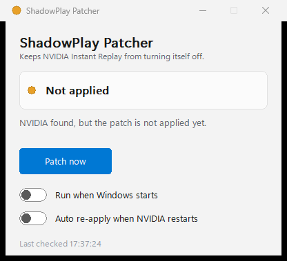
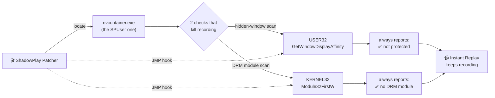

<div align="center">

# 🎬 ShadowPlay Patcher

**Stop NVIDIA Instant Replay from switching itself off.**

A tiny Windows tray app that keeps ShadowPlay / Instant Replay recording — even when a password manager is open or DRM video is playing.




</div>

---

## The problem

You finish an amazing clip, hit **Save Replay**… and nothing. Instant Replay quietly turned itself off ten minutes ago and never came back.

NVIDIA does this on purpose whenever it thinks "protected content" is on screen:

- 🪟 **A hidden window exists** — password managers (KeePassXC), the Zoom "you're sharing your screen" bar, and similar tools ask Windows *not* to be captured. ShadowPlay sees that and stops **everything**.
- 🎞️ **DRM video is playing** — Netflix, etc. in a browser loads the Widevine module, and ShadowPlay silently pauses recording while it's there.

The worst part: it often doesn't turn back **on** by itself. You lose clips without knowing.

## The fix

Instead of babysitting ShadowPlay and flipping it back on (like [AlwaysShadow](https://github.com/Verpous/AlwaysShadow/) does), this tool goes to the source: it makes those two checks always come back "nothing to see here."

Nothing is written to disk inside NVIDIA — the change lives in the running process only, so a reboot fully undoes it. That's why the app can **re-apply automatically** whenever NVIDIA restarts.

## How it works



In plain words: the app finds the right NVIDIA process, then rewrites the very start of those two functions with a small jump to a stub that returns the "all clear" answer. Because it patches standard Windows functions rather than NVIDIA's own code, it survives most driver updates.

Want the deep dive? See [`re_research.md`](re_research.md).

## Status at a glance

The tray icon and window pill change color so you always know where you stand:

| Dot | Meaning |
|-----|---------|
| 🟢 **Active** | Patched — Instant Replay will keep recording |
| 🟡 **Not applied** | NVIDIA is running but not patched yet |
| ⚪ **NVIDIA not found** | The ShadowPlay process isn't running |
| 🔴 **Error** | Something failed (usually needs admin — see below) |

## Download & use

1. Grab `ShadowPlay_Patcher_GUI.exe` from the [**Releases**](../../releases) page.
2. Double-click it. It lives in your system tray (by the clock).
3. Click **Patch now**, or just turn on the two switches:
   - **Run when Windows starts** — never think about it again.
   - **Auto re-apply when NVIDIA restarts** — re-patches within seconds if NVIDIA relaunches.

That's it. One file, no installer, no runtime to download.

> [!TIP]
> If the status turns 🔴 **Error** with "access denied", right-click the exe → **Run as administrator**. NVIDIA's process usually runs as your user, so this often isn't needed.

### Command-line flags

| Flag | Effect |
|------|--------|
| `--minimized` | Start hidden in the tray (used by the autostart entry). |
| `--no-apply`  | Observe-only: show status but never patch automatically. |

There's also a headless `ShadowPlay_Patcher.exe` (console, one-shot patch) if you prefer scripting it.

## Safety & antivirus

This app writes into another process's memory — the same technique real malware uses, so **antivirus may flag it**. Here that behavior is the entire, legitimate point, and the full source is right here for you to read. It:

- ✅ never touches the network, your files, or the registry (except the optional "Run at startup" key **you** toggle),
- ✅ only modifies the running NVIDIA process, in memory, reversible on reboot,
- ✅ ships as a single, statically linked executable.

> [!WARNING]
> Turning off the hidden-window check means windows that asked to stay private (like a password manager) **can now appear in your recordings**. Review clips before sharing them.

## Build from source

You need Visual Studio 2022/2026 with the C++ workload (Windows SDK + MSVC). No other dependencies.

**With CMake (builds the GUI, CLI, and tests):**

```bash
cmake -G Ninja -S . -B build -DCMAKE_BUILD_TYPE=Release
cmake --build build
```

Outputs land in `build/`: `ShadowPlay_Patcher_GUI.exe`, `ShadowPlay_Patcher.exe`, and `ShadowPlay_Tests.exe`.

**With the Visual Studio solution (CLI only):** open `ShadowPlay_Patcher.sln` and build Release · x64.

## Tests

The project ships a real test runner (`ShadowPlay_Tests.exe`). It doesn't just unit-test the helpers — its integration tests **patch the test process's own** `GetWindowDisplayAffinity` and `Module32FirstW`, then call them to prove the hook actually flips the behavior. Same injection path as the real thing, zero risk to NVIDIA.

```bash
build\ShadowPlay_Tests.exe
# === 25/25 checks passed, 0 failed ===
```

## What's different in this fork

- 🖥️ **Tray + Fluent GUI** — status at a glance, one-click patch, autostart, auto re-apply. No more re-running a console after every reboot.
- 🐛 **Crash bug fixed** — the original could redirect NVIDIA into empty memory if a write failed; now it bails out cleanly.
- 🧷 **Safer & more robust** — idempotent (no memory leak on re-run), guards against forwarded exports, tighter memory protection and process rights, null-safe stubs.
- 🧪 **Test suite** — 25 checks covering the assembler, stubs, utilities, and live self-patching.

## Credits

- Original project by [**furyzenblade**](https://github.com/furyzenblade/ShadowPlay_Patcher) — the research and the working patch are theirs.
- The same patch also exists as a [**Windhawk mod**](https://windhawk.net/), which handles the browser-DRM-in-Chrome case more completely today.

## License

This is a fork; licensing follows the upstream project. Use at your own risk — it modifies a running NVIDIA process.
